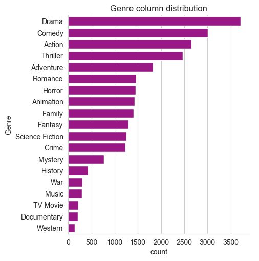
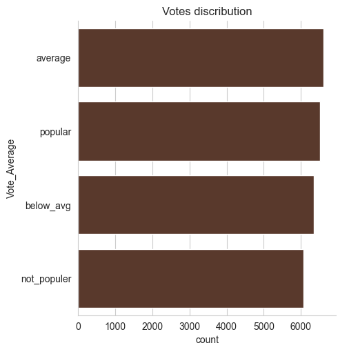

```python
import pandas as pd
import matplotlib.pyplot as plt
import seaborn as sns
import warnings 
warnings.filterwarnings('ignore')
```


```python
df= pd.read_csv("my_movie_db.csv")
```


```python
df.head()
```


<div>
<style scoped>
    .dataframe tbody tr th:only-of-type {
        vertical-align: middle;
    }

    .dataframe tbody tr th {
        vertical-align: top;
    }

    .dataframe thead th {
        text-align: right;
    }
</style>
<table border="1" class="dataframe">
  <thead>
    <tr style="text-align: right;">
      <th></th>
      <th>Release_Date</th>
      <th>Title</th>
      <th>Overview</th>
      <th>Popularity</th>
      <th>Vote_Count</th>
      <th>Vote_Average</th>
      <th>Original_Language</th>
      <th>Genre</th>
      <th>Poster_Url</th>
    </tr>
  </thead>
  <tbody>
    <tr>
      <th>0</th>
      <td>12/15/2021</td>
      <td>Spider-Man: No Way Home</td>
      <td>Peter Parker is unmasked and no longer able to...</td>
      <td>5083.954</td>
      <td>8940</td>
      <td>8.3</td>
      <td>en</td>
      <td>Action, Adventure, Science Fiction</td>
      <td>https://image.tmdb.org/t/p/original/1g0dhYtq4i...</td>
    </tr>
    <tr>
      <th>1</th>
      <td>3/1/2022</td>
      <td>The Batman</td>
      <td>In his second year of fighting crime, Batman u...</td>
      <td>3827.658</td>
      <td>1151</td>
      <td>8.1</td>
      <td>en</td>
      <td>Crime, Mystery, Thriller</td>
      <td>https://image.tmdb.org/t/p/original/74xTEgt7R3...</td>
    </tr>
    <tr>
      <th>2</th>
      <td>2/25/2022</td>
      <td>No Exit</td>
      <td>Stranded at a rest stop in the mountains durin...</td>
      <td>2618.087</td>
      <td>122</td>
      <td>6.3</td>
      <td>en</td>
      <td>Thriller</td>
      <td>https://image.tmdb.org/t/p/original/vDHsLnOWKl...</td>
    </tr>
    <tr>
      <th>3</th>
      <td>11/24/2021</td>
      <td>Encanto</td>
      <td>The tale of an extraordinary family, the Madri...</td>
      <td>2402.201</td>
      <td>5076</td>
      <td>7.7</td>
      <td>en</td>
      <td>Animation, Comedy, Family, Fantasy</td>
      <td>https://image.tmdb.org/t/p/original/4j0PNHkMr5...</td>
    </tr>
    <tr>
      <th>4</th>
      <td>12/22/2021</td>
      <td>The King's Man</td>
      <td>As a collection of history's worst tyrants and...</td>
      <td>1895.511</td>
      <td>1793</td>
      <td>7</td>
      <td>en</td>
      <td>Action, Adventure, Thriller, War</td>
      <td>https://image.tmdb.org/t/p/original/aq4Pwv5Xeu...</td>
    </tr>
  </tbody>
</table>
</div>


```python
df.info()
```

    <class 'pandas.core.frame.DataFrame'>
    RangeIndex: 9837 entries, 0 to 9836
    Data columns (total 9 columns):
     #   Column             Non-Null Count  Dtype  
    ---  ------             --------------  -----  
     0   Release_Date       9837 non-null   object 
     1   Title              9828 non-null   object 
     2   Overview           9828 non-null   object 
     3   Popularity         9827 non-null   float64
     4   Vote_Count         9827 non-null   object 
     5   Vote_Average       9827 non-null   object 
     6   Original_Language  9827 non-null   object 
     7   Genre              9826 non-null   object 
     8   Poster_Url         9826 non-null   object 
    dtypes: float64(1), object(8)
    memory usage: 691.8+ KB
    


```python
# show total null column
df.isnull().sum()
```


    Release_Date          0
    Title                 9
    Overview              9
    Popularity           10
    Vote_Count           10
    Vote_Average         10
    Original_Language    10
    Genre                11
    Poster_Url           11
    dtype: int64


```python
# remove null value
df.dropna(inplace = True)
```


```python
df.info()
```

    <class 'pandas.core.frame.DataFrame'>
    Index: 9826 entries, 0 to 9836
    Data columns (total 9 columns):
     #   Column             Non-Null Count  Dtype  
    ---  ------             --------------  -----  
     0   Release_Date       9826 non-null   object 
     1   Title              9826 non-null   object 
     2   Overview           9826 non-null   object 
     3   Popularity         9826 non-null   float64
     4   Vote_Count         9826 non-null   object 
     5   Vote_Average       9826 non-null   object 
     6   Original_Language  9826 non-null   object 
     7   Genre              9826 non-null   object 
     8   Poster_Url         9826 non-null   object 
    dtypes: float64(1), object(8)
    memory usage: 767.7+ KB
    


```python
# change data type 
df['Vote_Count']=df['Vote_Count'].replace("en","0")
df['Vote_Count']=df['Vote_Count'].astype(int)
```


```python
df['Vote_Average']=df['Vote_Average'].replace("Animation","0")
df['Vote_Average']=df['Vote_Average'].astype(float)
```


```python
# show particulr column hader
df['Genre'].head()
```


    0    Action, Adventure, Science Fiction
    1              Crime, Mystery, Thriller
    2                              Thriller
    3    Animation, Comedy, Family, Fantasy
    4      Action, Adventure, Thriller, War
    Name: Genre, dtype: object


```python
# show duplicated
df.duplicated()
```


    0       False
    1       False
    2       False
    3       False
    4       False
            ...  
    9832    False
    9833    False
    9834    False
    9835    False
    9836    False
    Length: 9826, dtype: bool


```python
df.describe()
```


<div>
<style scoped>
    .dataframe tbody tr th:only-of-type {
        vertical-align: middle;
    }

    .dataframe tbody tr th {
        vertical-align: top;
    }

    .dataframe thead th {
        text-align: right;
    }
</style>
<table border="1" class="dataframe">
  <thead>
    <tr style="text-align: right;">
      <th></th>
      <th>Popularity</th>
      <th>Vote_Count</th>
      <th>Vote_Average</th>
    </tr>
  </thead>
  <tbody>
    <tr>
      <th>count</th>
      <td>9826.000000</td>
      <td>9826.000000</td>
      <td>9826.000000</td>
    </tr>
    <tr>
      <th>mean</th>
      <td>40.323951</td>
      <td>1392.943721</td>
      <td>6.439467</td>
    </tr>
    <tr>
      <th>std</th>
      <td>108.879332</td>
      <td>2611.303856</td>
      <td>1.129797</td>
    </tr>
    <tr>
      <th>min</th>
      <td>13.354000</td>
      <td>0.000000</td>
      <td>0.000000</td>
    </tr>
    <tr>
      <th>25%</th>
      <td>16.128250</td>
      <td>146.000000</td>
      <td>5.900000</td>
    </tr>
    <tr>
      <th>50%</th>
      <td>21.195000</td>
      <td>444.000000</td>
      <td>6.500000</td>
    </tr>
    <tr>
      <th>75%</th>
      <td>35.179250</td>
      <td>1376.000000</td>
      <td>7.100000</td>
    </tr>
    <tr>
      <th>max</th>
      <td>5083.954000</td>
      <td>31077.000000</td>
      <td>10.000000</td>
    </tr>
  </tbody>
</table>
</div>


**Exploration Summary**


```python
#1. we have a dataframe consisting of 9827 rows and 9 columns.
#2. Our dataset looks a bit tidy with no NaNs nor duplicated values.
#3. Release_Date Column needs to casted into date time  and to extract only the year value.
#4. Vote_Count & Vote_Average columns needs to casted into int and float respectively
#4. Overview, original_language and poster_URL would not be so useful during analysis, so we'll drop them.
#5. There is noticable outliers in popularity column.
#6. Vote_Average better be categorised for proper analysis.
#7. Genre column has comma seperated values and white spaces that needs to be handled  and casted into category .
```


```python
df.columns
```


    Index(['Release_Date', 'Title', 'Overview', 'Popularity', 'Vote_Count',
           'Vote_Average', 'Original_Language', 'Genre', 'Poster_Url'],
          dtype='object')


```python
df['Release_Date'] = pd.to_datetime(df['Release_Date'])
print(df['Release_Date'].dtypes)
```

    datetime64[ns]
    


```python
df['Release_Date'] = df['Release_Date'].dt.year
df['Release_Date'].dtypes
```


    dtype('int32')


```python
df.head()
```


<div>
<style scoped>
    .dataframe tbody tr th:only-of-type {
        vertical-align: middle;
    }

    .dataframe tbody tr th {
        vertical-align: top;
    }

    .dataframe thead th {
        text-align: right;
    }
</style>
<table border="1" class="dataframe">
  <thead>
    <tr style="text-align: right;">
      <th></th>
      <th>Release_Date</th>
      <th>Title</th>
      <th>Overview</th>
      <th>Popularity</th>
      <th>Vote_Count</th>
      <th>Vote_Average</th>
      <th>Original_Language</th>
      <th>Genre</th>
      <th>Poster_Url</th>
    </tr>
  </thead>
  <tbody>
    <tr>
      <th>0</th>
      <td>2021</td>
      <td>Spider-Man: No Way Home</td>
      <td>Peter Parker is unmasked and no longer able to...</td>
      <td>5083.954</td>
      <td>8940</td>
      <td>8.3</td>
      <td>en</td>
      <td>Action, Adventure, Science Fiction</td>
      <td>https://image.tmdb.org/t/p/original/1g0dhYtq4i...</td>
    </tr>
    <tr>
      <th>1</th>
      <td>2022</td>
      <td>The Batman</td>
      <td>In his second year of fighting crime, Batman u...</td>
      <td>3827.658</td>
      <td>1151</td>
      <td>8.1</td>
      <td>en</td>
      <td>Crime, Mystery, Thriller</td>
      <td>https://image.tmdb.org/t/p/original/74xTEgt7R3...</td>
    </tr>
    <tr>
      <th>2</th>
      <td>2022</td>
      <td>No Exit</td>
      <td>Stranded at a rest stop in the mountains durin...</td>
      <td>2618.087</td>
      <td>122</td>
      <td>6.3</td>
      <td>en</td>
      <td>Thriller</td>
      <td>https://image.tmdb.org/t/p/original/vDHsLnOWKl...</td>
    </tr>
    <tr>
      <th>3</th>
      <td>2021</td>
      <td>Encanto</td>
      <td>The tale of an extraordinary family, the Madri...</td>
      <td>2402.201</td>
      <td>5076</td>
      <td>7.7</td>
      <td>en</td>
      <td>Animation, Comedy, Family, Fantasy</td>
      <td>https://image.tmdb.org/t/p/original/4j0PNHkMr5...</td>
    </tr>
    <tr>
      <th>4</th>
      <td>2021</td>
      <td>The King's Man</td>
      <td>As a collection of history's worst tyrants and...</td>
      <td>1895.511</td>
      <td>1793</td>
      <td>7.0</td>
      <td>en</td>
      <td>Action, Adventure, Thriller, War</td>
      <td>https://image.tmdb.org/t/p/original/aq4Pwv5Xeu...</td>
    </tr>
  </tbody>
</table>
</div>


drope the columns


```python
cols = ['Overview','Original_Language','Poster_Url']
```


```python
df.drop(col,axis=1,inplace = True)
df.columns
```


    Index(['Release_Date', 'Title', 'Popularity', 'Vote_Count', 'Vote_Average',
           'Genre'],
          dtype='object')


```python
df.head()
```


<div>
<style scoped>
    .dataframe tbody tr th:only-of-type {
        vertical-align: middle;
    }

    .dataframe tbody tr th {
        vertical-align: top;
    }

    .dataframe thead th {
        text-align: right;
    }
</style>
<table border="1" class="dataframe">
  <thead>
    <tr style="text-align: right;">
      <th></th>
      <th>Release_Date</th>
      <th>Title</th>
      <th>Popularity</th>
      <th>Vote_Count</th>
      <th>Vote_Average</th>
      <th>Genre</th>
    </tr>
  </thead>
  <tbody>
    <tr>
      <th>0</th>
      <td>2021</td>
      <td>Spider-Man: No Way Home</td>
      <td>5083.954</td>
      <td>8940</td>
      <td>8.3</td>
      <td>Action, Adventure, Science Fiction</td>
    </tr>
    <tr>
      <th>1</th>
      <td>2022</td>
      <td>The Batman</td>
      <td>3827.658</td>
      <td>1151</td>
      <td>8.1</td>
      <td>Crime, Mystery, Thriller</td>
    </tr>
    <tr>
      <th>2</th>
      <td>2022</td>
      <td>No Exit</td>
      <td>2618.087</td>
      <td>122</td>
      <td>6.3</td>
      <td>Thriller</td>
    </tr>
    <tr>
      <th>3</th>
      <td>2021</td>
      <td>Encanto</td>
      <td>2402.201</td>
      <td>5076</td>
      <td>7.7</td>
      <td>Animation, Comedy, Family, Fantasy</td>
    </tr>
    <tr>
      <th>4</th>
      <td>2021</td>
      <td>The King's Man</td>
      <td>1895.511</td>
      <td>1793</td>
      <td>7.0</td>
      <td>Action, Adventure, Thriller, War</td>
    </tr>
  </tbody>
</table>
</div>


# categorizing Vote_Average column

We would cut the Vote_Average values and make 4 categories popular, below_avg, not_popular to describe it more using Catigorize_col() function provided above


```python
def catigorize_col(df,col,labels):

    edges = [df[col].describe()['min'],
             df[col].describe()['25%'],
             df[col].describe()['50%'],
             df[col].describe()['75%'],
             df[col].describe()['max']]
    df[col]=pd.cut(df[col], edges, labels = labels,duplicates ='drop')
    return df
```


```python
labels = ['not_populer','below_avg','average','popular']

catigorize_col(df, 'Vote_Average', labels)

df ['Vote_Average'].unique()
```


    ['popular', 'below_avg', 'average', 'not_populer', NaN]
    Categories (4, object): ['not_populer' < 'below_avg' < 'average' < 'popular']


```python
df.head()
```


<div>
<style scoped>
    .dataframe tbody tr th:only-of-type {
        vertical-align: middle;
    }

    .dataframe tbody tr th {
        vertical-align: top;
    }

    .dataframe thead th {
        text-align: right;
    }
</style>
<table border="1" class="dataframe">
  <thead>
    <tr style="text-align: right;">
      <th></th>
      <th>Release_Date</th>
      <th>Title</th>
      <th>Popularity</th>
      <th>Vote_Count</th>
      <th>Vote_Average</th>
      <th>Genre</th>
    </tr>
  </thead>
  <tbody>
    <tr>
      <th>0</th>
      <td>2021</td>
      <td>Spider-Man: No Way Home</td>
      <td>5083.954</td>
      <td>8940</td>
      <td>popular</td>
      <td>Action, Adventure, Science Fiction</td>
    </tr>
    <tr>
      <th>1</th>
      <td>2022</td>
      <td>The Batman</td>
      <td>3827.658</td>
      <td>1151</td>
      <td>popular</td>
      <td>Crime, Mystery, Thriller</td>
    </tr>
    <tr>
      <th>2</th>
      <td>2022</td>
      <td>No Exit</td>
      <td>2618.087</td>
      <td>122</td>
      <td>below_avg</td>
      <td>Thriller</td>
    </tr>
    <tr>
      <th>3</th>
      <td>2021</td>
      <td>Encanto</td>
      <td>2402.201</td>
      <td>5076</td>
      <td>popular</td>
      <td>Animation, Comedy, Family, Fantasy</td>
    </tr>
    <tr>
      <th>4</th>
      <td>2021</td>
      <td>The King's Man</td>
      <td>1895.511</td>
      <td>1793</td>
      <td>average</td>
      <td>Action, Adventure, Thriller, War</td>
    </tr>
  </tbody>
</table>
</div>


```python

```


```python
df['Vote_Average'].value_counts()
```


    Vote_Average
    not_populer    2467
    popular        2450
    average        2411
    below_avg      2398
    Name: count, dtype: int64


```python
df.info()
```

    <class 'pandas.core.frame.DataFrame'>
    Index: 9826 entries, 0 to 9836
    Data columns (total 6 columns):
     #   Column        Non-Null Count  Dtype   
    ---  ------        --------------  -----   
     0   Release_Date  9826 non-null   int32   
     1   Title         9826 non-null   object  
     2   Popularity    9826 non-null   float64 
     3   Vote_Count    9826 non-null   int64   
     4   Vote_Average  9726 non-null   category
     5   Genre         9826 non-null   object  
    dtypes: category(1), float64(1), int32(1), int64(1), object(2)
    memory usage: 432.0+ KB
    


```python
df.isnull().sum()
```


    Release_Date      0
    Title             0
    Popularity        0
    Vote_Count        0
    Vote_Average    100
    Genre             0
    dtype: int64


```python
df.dropna(inplace = True)
```


```python
df.isnull().sum()
```


    Release_Date    0
    Title           0
    Popularity      0
    Vote_Count      0
    Vote_Average    0
    Genre           0
    dtype: int64


**We would cut the Vote_Average values and make 4 categories : Popular,Average, Below_avg, not popular to describe it more using categorize_col() function provided above.**


```python
df['Genre'] = df['Genre'].str.split(', ')

df = df.explode('Genre').reset_index(drop = True)
df.head()
```


<div>
<style scoped>
    .dataframe tbody tr th:only-of-type {
        vertical-align: middle;
    }

    .dataframe tbody tr th {
        vertical-align: top;
    }

    .dataframe thead th {
        text-align: right;
    }
</style>
<table border="1" class="dataframe">
  <thead>
    <tr style="text-align: right;">
      <th></th>
      <th>Release_Date</th>
      <th>Title</th>
      <th>Popularity</th>
      <th>Vote_Count</th>
      <th>Vote_Average</th>
      <th>Genre</th>
    </tr>
  </thead>
  <tbody>
    <tr>
      <th>0</th>
      <td>2021</td>
      <td>Spider-Man: No Way Home</td>
      <td>5083.954</td>
      <td>8940</td>
      <td>popular</td>
      <td>Action</td>
    </tr>
    <tr>
      <th>1</th>
      <td>2021</td>
      <td>Spider-Man: No Way Home</td>
      <td>5083.954</td>
      <td>8940</td>
      <td>popular</td>
      <td>Adventure</td>
    </tr>
    <tr>
      <th>2</th>
      <td>2021</td>
      <td>Spider-Man: No Way Home</td>
      <td>5083.954</td>
      <td>8940</td>
      <td>popular</td>
      <td>Science Fiction</td>
    </tr>
    <tr>
      <th>3</th>
      <td>2022</td>
      <td>The Batman</td>
      <td>3827.658</td>
      <td>1151</td>
      <td>popular</td>
      <td>Crime</td>
    </tr>
    <tr>
      <th>4</th>
      <td>2022</td>
      <td>The Batman</td>
      <td>3827.658</td>
      <td>1151</td>
      <td>popular</td>
      <td>Mystery</td>
    </tr>
  </tbody>
</table>
</div>


```python
#casting column into category
df['Genre'] = df['Genre'].astype('category')
df['Genre'].dtype
```


    CategoricalDtype(categories=['Action', 'Adventure', 'Animation', 'Comedy', 'Crime',
                      'Documentary', 'Drama', 'Family', 'Fantasy', 'History',
                      'Horror', 'Music', 'Mystery', 'Romance', 'Science Fiction',
                      'TV Movie', 'Thriller', 'War', 'Western'],
    , ordered=False, categories_dtype=object)


```python
df.head()
```


<div>
<style scoped>
    .dataframe tbody tr th:only-of-type {
        vertical-align: middle;
    }

    .dataframe tbody tr th {
        vertical-align: top;
    }

    .dataframe thead th {
        text-align: right;
    }
</style>
<table border="1" class="dataframe">
  <thead>
    <tr style="text-align: right;">
      <th></th>
      <th>Release_Date</th>
      <th>Title</th>
      <th>Popularity</th>
      <th>Vote_Count</th>
      <th>Vote_Average</th>
      <th>Genre</th>
    </tr>
  </thead>
  <tbody>
    <tr>
      <th>0</th>
      <td>2021</td>
      <td>Spider-Man: No Way Home</td>
      <td>5083.954</td>
      <td>8940</td>
      <td>popular</td>
      <td>Action</td>
    </tr>
    <tr>
      <th>1</th>
      <td>2021</td>
      <td>Spider-Man: No Way Home</td>
      <td>5083.954</td>
      <td>8940</td>
      <td>popular</td>
      <td>Adventure</td>
    </tr>
    <tr>
      <th>2</th>
      <td>2021</td>
      <td>Spider-Man: No Way Home</td>
      <td>5083.954</td>
      <td>8940</td>
      <td>popular</td>
      <td>Science Fiction</td>
    </tr>
    <tr>
      <th>3</th>
      <td>2022</td>
      <td>The Batman</td>
      <td>3827.658</td>
      <td>1151</td>
      <td>popular</td>
      <td>Crime</td>
    </tr>
    <tr>
      <th>4</th>
      <td>2022</td>
      <td>The Batman</td>
      <td>3827.658</td>
      <td>1151</td>
      <td>popular</td>
      <td>Mystery</td>
    </tr>
  </tbody>
</table>
</div>


```python
df.info()
```

    <class 'pandas.core.frame.DataFrame'>
    RangeIndex: 25551 entries, 0 to 25550
    Data columns (total 6 columns):
     #   Column        Non-Null Count  Dtype   
    ---  ------        --------------  -----   
     0   Release_Date  25551 non-null  int32   
     1   Title         25551 non-null  object  
     2   Popularity    25551 non-null  float64 
     3   Vote_Count    25551 non-null  int64   
     4   Vote_Average  25551 non-null  category
     5   Genre         25551 non-null  category
    dtypes: category(2), float64(1), int32(1), int64(1), object(1)
    memory usage: 749.6+ KB
    


```python
df.nunique()
```


    Release_Date     100
    Title           9414
    Popularity      8087
    Vote_Count      3265
    Vote_Average       4
    Genre             19
    dtype: int64


# Data Visualization


```python
sns.set_style('whitegrid')
```

**1.What is the most frequent genre of movies released on Netflix?**


```python
df['Genre'].describe()
```


    count     25551
    unique       19
    top       Drama
    freq       3715
    Name: Genre, dtype: object


```python
sns.catplot(y ='Genre' , data = df,kind ='count',
            order = df['Genre'].value_counts().index,
            color = '#AE0395')
plt.title('Genre column distribution')
plt.show()
```


    

    


**2.Which has highest votes in vote avg column?**


```python
df.head()
```


<div>
<style scoped>
    .dataframe tbody tr th:only-of-type {
        vertical-align: middle;
    }

    .dataframe tbody tr th {
        vertical-align: top;
    }

    .dataframe thead th {
        text-align: right;
    }
</style>
<table border="1" class="dataframe">
  <thead>
    <tr style="text-align: right;">
      <th></th>
      <th>Release_Date</th>
      <th>Title</th>
      <th>Popularity</th>
      <th>Vote_Count</th>
      <th>Vote_Average</th>
      <th>Genre</th>
    </tr>
  </thead>
  <tbody>
    <tr>
      <th>0</th>
      <td>2021</td>
      <td>Spider-Man: No Way Home</td>
      <td>5083.954</td>
      <td>8940</td>
      <td>popular</td>
      <td>Action</td>
    </tr>
    <tr>
      <th>1</th>
      <td>2021</td>
      <td>Spider-Man: No Way Home</td>
      <td>5083.954</td>
      <td>8940</td>
      <td>popular</td>
      <td>Adventure</td>
    </tr>
    <tr>
      <th>2</th>
      <td>2021</td>
      <td>Spider-Man: No Way Home</td>
      <td>5083.954</td>
      <td>8940</td>
      <td>popular</td>
      <td>Science Fiction</td>
    </tr>
    <tr>
      <th>3</th>
      <td>2022</td>
      <td>The Batman</td>
      <td>3827.658</td>
      <td>1151</td>
      <td>popular</td>
      <td>Crime</td>
    </tr>
    <tr>
      <th>4</th>
      <td>2022</td>
      <td>The Batman</td>
      <td>3827.658</td>
      <td>1151</td>
      <td>popular</td>
      <td>Mystery</td>
    </tr>
  </tbody>
</table>
</div>


```python
sns.catplot (y='Vote_Average', data = df, kind = 'count',
             order = df ['Vote_Average'].value_counts().index,
             color = '#603625')
plt.title('Votes discribution')
plt.show()
             
```


    

    


**3.What movie got the highest popularity? what's its genre?**


```python
df.head(2)
```


<div>
<style scoped>
    .dataframe tbody tr th:only-of-type {
        vertical-align: middle;
    }

    .dataframe tbody tr th {
        vertical-align: top;
    }

    .dataframe thead th {
        text-align: right;
    }
</style>
<table border="1" class="dataframe">
  <thead>
    <tr style="text-align: right;">
      <th></th>
      <th>Release_Date</th>
      <th>Title</th>
      <th>Popularity</th>
      <th>Vote_Count</th>
      <th>Vote_Average</th>
      <th>Genre</th>
    </tr>
  </thead>
  <tbody>
    <tr>
      <th>0</th>
      <td>2021</td>
      <td>Spider-Man: No Way Home</td>
      <td>5083.954</td>
      <td>8940</td>
      <td>popular</td>
      <td>Action</td>
    </tr>
    <tr>
      <th>1</th>
      <td>2021</td>
      <td>Spider-Man: No Way Home</td>
      <td>5083.954</td>
      <td>8940</td>
      <td>popular</td>
      <td>Adventure</td>
    </tr>
  </tbody>
</table>
</div>


```python
df[df['Popularity'] ==df['Popularity'].max()]
```


<div>
<style scoped>
    .dataframe tbody tr th:only-of-type {
        vertical-align: middle;
    }

    .dataframe tbody tr th {
        vertical-align: top;
    }

    .dataframe thead th {
        text-align: right;
    }
</style>
<table border="1" class="dataframe">
  <thead>
    <tr style="text-align: right;">
      <th></th>
      <th>Release_Date</th>
      <th>Title</th>
      <th>Popularity</th>
      <th>Vote_Count</th>
      <th>Vote_Average</th>
      <th>Genre</th>
    </tr>
  </thead>
  <tbody>
    <tr>
      <th>0</th>
      <td>2021</td>
      <td>Spider-Man: No Way Home</td>
      <td>5083.954</td>
      <td>8940</td>
      <td>popular</td>
      <td>Action</td>
    </tr>
    <tr>
      <th>1</th>
      <td>2021</td>
      <td>Spider-Man: No Way Home</td>
      <td>5083.954</td>
      <td>8940</td>
      <td>popular</td>
      <td>Adventure</td>
    </tr>
    <tr>
      <th>2</th>
      <td>2021</td>
      <td>Spider-Man: No Way Home</td>
      <td>5083.954</td>
      <td>8940</td>
      <td>popular</td>
      <td>Science Fiction</td>
    </tr>
  </tbody>
</table>
</div>


**4.What movie got the lowest popularity? what's its genre?**


```python
df[df['Popularity'] ==df['Popularity'].min()]
```


<div>
<style scoped>
    .dataframe tbody tr th:only-of-type {
        vertical-align: middle;
    }

    .dataframe tbody tr th {
        vertical-align: top;
    }

    .dataframe thead th {
        text-align: right;
    }
</style>
<table border="1" class="dataframe">
  <thead>
    <tr style="text-align: right;">
      <th></th>
      <th>Release_Date</th>
      <th>Title</th>
      <th>Popularity</th>
      <th>Vote_Count</th>
      <th>Vote_Average</th>
      <th>Genre</th>
    </tr>
  </thead>
  <tbody>
    <tr>
      <th>25545</th>
      <td>2021</td>
      <td>The United States vs. Billie Holiday</td>
      <td>13.354</td>
      <td>152</td>
      <td>average</td>
      <td>Music</td>
    </tr>
    <tr>
      <th>25546</th>
      <td>2021</td>
      <td>The United States vs. Billie Holiday</td>
      <td>13.354</td>
      <td>152</td>
      <td>average</td>
      <td>Drama</td>
    </tr>
    <tr>
      <th>25547</th>
      <td>2021</td>
      <td>The United States vs. Billie Holiday</td>
      <td>13.354</td>
      <td>152</td>
      <td>average</td>
      <td>History</td>
    </tr>
    <tr>
      <th>25548</th>
      <td>1984</td>
      <td>Threads</td>
      <td>13.354</td>
      <td>186</td>
      <td>popular</td>
      <td>War</td>
    </tr>
    <tr>
      <th>25549</th>
      <td>1984</td>
      <td>Threads</td>
      <td>13.354</td>
      <td>186</td>
      <td>popular</td>
      <td>Drama</td>
    </tr>
    <tr>
      <th>25550</th>
      <td>1984</td>
      <td>Threads</td>
      <td>13.354</td>
      <td>186</td>
      <td>popular</td>
      <td>Science Fiction</td>
    </tr>
  </tbody>
</table>
</div>


**5.Which year has the most filmmed movies?**

df['Release_Date'].hist()
plt.title('Release Data Column Distribution')
plt.show()
**Conclusion**

**1.What is the most frequent genre of movies released on Netflix?**

**ans- Drama Genre is the most frequent genre in our dataset and has appeared more than 14% of the times among 19 other Genres.**

**2.Which has highest votes in vote avg column?**

**ans- the average category has the highest number of votes in the "Vote_Average" column.average has the highest votes, with a count of approximately 6,200.**

**3.What movie got the highest popularity? what's its genre?**

**ans- Spider-Man: No Way Home has the highest popularity rate in our dataset and it has genres of Action, Adventure and Science Fiction**

**4.What movie got the lowest popularity? what's its genre?**

**ans - The United States vs. Billie Holiday, Threads has the the lowest popularity in our dataset and it has genres of Music,Drama,History,War,Drama and Science Fiction**

**5.Which year has the most filmmed movies?**

**ans- year 2020 has the highest filmmed rate in our dataset**


```python

```
